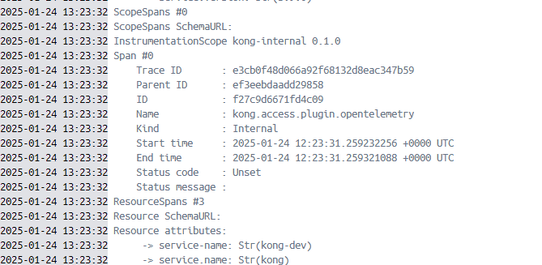
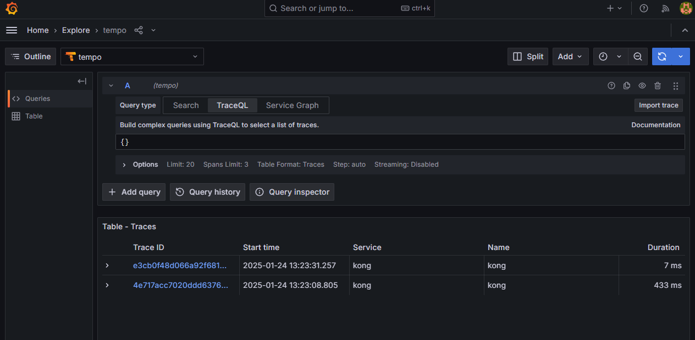
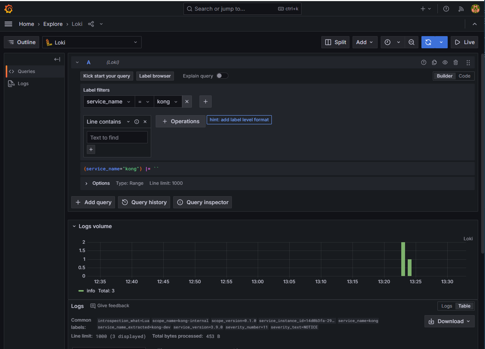

# Kong + Observability stack
The purpose of this test is to practise on how to create a deployment with Kong and some other tools to have an observability stack.
For this observability stack we have chosen Loki for Kong logs and Tempo for Traces.
All the logs and traces will be visible in Grafana.
We also created a service to have a echo-server to have some endpoint available in our test.

# Docker compose file
Kong will be deployed together with postgress(no dbless)

## Postgres
```
services:
  db:
    image: postgres:14
    container_name: postgres
    environment:
      POSTGRES_DB: kong
      POSTGRES_USER: kong
      POSTGRES_PASSWORD: kong
```

## Kong migrations
```
services:
  ...
  kong-database-migrations:
    image: kong:latest
    container_name: kong-database-migrations
    command: kong migrations bootstrap && kong migrations up
    environment:
      KONG_DATABASE: postgres
      KONG_PG_HOST: db
      KONG_PG_PASSWORD: kong
    depends_on:
        - db
```

## Kong
```
services: 
  ...
  kong:
    image: kong:latest
    container_name: kong
    environment:
      KONG_DATABASE: postgres
      KONG_PG_HOST: db
      KONG_PG_USER: kong
      KONG_PG_PASSWORD: kong
      KONG_PROXY_ACCESS_LOG: /dev/stdout
      KONG_ADMIN_ACCESS_LOG: /dev/stdout
      KONG_PROXY_ERROR_LOG: /dev/stderr
      KONG_ADMIN_ERROR_LOG: /dev/stderr
      KONG_LOG_LEVEL: info
      KONG_ADMIN_LISTEN: 0.0.0.0:8001
      KONG_ADMING_GUI_URL: http://localhost:8002
      KONG_OPENTELEMETRY_TRACING: all
      KONG_OPENTELEMETRY_TRACING_SAMPLING_RATE: 1.0
    ports:
    - "8000:8000"
    - "8443:8443"
    - "8001:8001"
    - "8444:8444"
    - "8002:8002"
    - "8445:8445"
    - "8003:8003"
    - "8004:8004"
    depends_on: 
        - db
        - kong-database-migrations
```

## Opentelemetry collector

```
services:
  ...
  opentelemetry:
    image: otel/opentelemetry-collector-contrib:0.117.0
    container_name: opentelemetry
    ports:
      - 4318:4318
      #- 55681:55681 # OTLP HTTP
    command: ["--config=/etc/otel-colector-config.yaml"]
    volumes:
      - ./otel.yaml:/etc/otel-colector-config.yaml
```

## Loki
```
services:
  ...
  loki: 
    image: grafana/loki:latest
    container_name: loki
    ports:
      - 3100:3100
    command: -config.file=/etc/loki/local-config.yaml
    
```

## Tempo
```
services:
  ...
  tempo:
    image: grafana/tempo:latest
    container_name: tempo
    ports:
      - 4138:4138
      - 3200:3200   # Tempo query endpoint
    volumes:
      - ./tempo-local-config.yaml:/etc/tempo/local-config.yaml
    command: -config.file=/etc/tempo/local-config.yaml
```

## Grafana
```
services: 
  ...
  grafana:
    environment:
      - GF_PATHS_PROVISIONING=/etc/grafana/provisioning
      - GF_AUTH_ANONYMOUS_ENABLED=true
      - GF_AUTH_ANONYMOUS_ORG_ROLE=Admin
    entrypoint:
      - sh
      - -euc
      - |
        mkdir -p /etc/grafana/provisioning/datasources
        cat <<EOF > /etc/grafana/provisioning/datasources/ds.yaml
        apiVersion: 1
        datasources:
        - name: Loki
          type: loki
          access: proxy 
          orgId: 1
          url: http://loki:3100
          basicAuth: false
          isDefault: true
          version: 1
          editable: false
        EOF
        /run.sh
    image: grafana/grafana:latest
    ports:
      - "3000:3000"
```

# Configuration files
## Opentelemetry collector
```
receivers:
  otlp:
    protocols:
      http:
        endpoint: 0.0.0.0:4318

processors:
  batch:
    send_batch_max_size: 1000
    send_batch_size: 100
    timeout: 10s

exporters:
  debug:
    verbosity: detailed
    sampling_initial: 5
    sampling_thereafter: 200
  otlphttp/loki:
    endpoint: http://loki:3100/otlp
    tls:
      insecure: true
  otlphttp/tempo:
    endpoint: http://tempo:4318
    tls:
      insecure: true

extensions:
  health_check:
  pprof:
  zpages:

service:
  extensions: [health_check, pprof, zpages]
  pipelines:
    traces:
      receivers: [otlp]
      processors: [batch]
      exporters: [debug, otlphttp/tempo]
    logs:
      receivers: [otlp]
      processors: [batch]
      exporters: [debug, otlphttp/loki]
```

## Tempo
```
server:
  http_listen_port: 3200

distributor:
  receivers:
    otlp:
      protocols:
        http:
          endpoint: "0.0.0.0:4318"

storage:
  trace:
    backend: local
    local:
      path: /tmp/tempo/blocks

compactor:
  compaction:
    block_retention: 24h
```

# Kong configuration
1. Need to create a service pointing to the endpoint  you want, in my case a container in docker called echo-server, but can be httpbin.org or whatever

2. Create a route to hit

3. Set up opentelemetry plugin pointing to the opentelemetry collector, in our case <container_name>:<port>

# Test

Once we hit the endpoint we need to check if the Opentelemetry Collector has received the traces


We can check that the traces are in tempo and grafana.


The same with the logs. We can check that Loki has received the logs from Kong.
